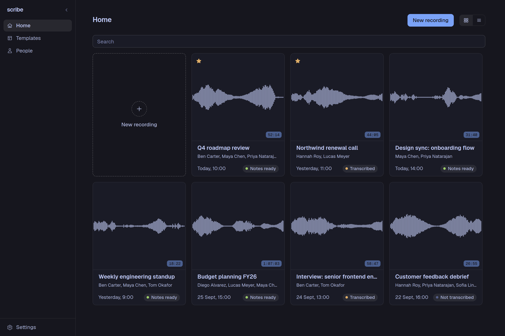

<p align="center">
    <picture>
        <source media="(prefers-color-scheme: dark)" srcset="assets/scribe-lockup-outline-on-dark.svg">
        <source media="(prefers-color-scheme: light)" srcset="assets/scribe-lockup-outline-on-light.svg">
        
    </picture>
</p>

&nbsp;

<p align="center">
    A desktop app that turns a meeting recording into formatted notes.
</p>

<p align="center">
    <a href="https://github.com/stratusadv/scribe/actions/workflows/release.yml"></a>
    <a href="https://github.com/stratusadv/scribe/releases/latest"></a>
    <a href="https://github.com/stratusadv/scribe/releases/latest"></a>
    <a href="LICENSE"></a>
</p>



## Overview

scribe is a desktop app that turns a recording of a meeting into a formatted document. A recording is captured from the microphone or dropped onto the window, transcribed via an API, and shaped by a template into notes, which are edited in place and exported to Word, Markdown, or PDF. The app is useful for anyone who leaves a meeting with an hour of audio and needs a page of decisions and actions from it, and each template is a short instruction to the AI, so a meeting summary, a policy document, and a handover document are each one template away.

## How It Works

The Home screen lists each recording with its participants, date, duration, and status, as a grid of tiles or a sortable table. A recording opens into three steps, shown as a bar at the top of the page.

- **Transcript**: The audio is sent to the transcription API and comes back as timestamped lines. Each line plays back on its own, copies with a click, and is corrected by hand with the pencil, or in bulk by telling the AI what to fix, such as a name it misheard throughout. A transcript from elsewhere is pasted in instead of recorded.
- **Meeting**: The people who were present and the people who were mentioned are picked from the People list, and a template is chosen for the notes. The AI uses each person's role and description to tell who is speaking and to spell their name correctly.
- **Notes**: The template and the transcript go to the notes API, and the result streams into a rich text editor. The notes are edited in place with the usual formatting tools, and any selection is rewritten by the AI with a quick action or a custom instruction. The finished notes are exported as a Word document, a Markdown file, or a PDF.

The People page holds each person once, with a role and a short description, so they are picked from a list on the Meeting step rather than typed each time. A group collects people who usually attend together, and picking the group ticks each of its members at once. The Templates page holds the layouts: each template is the headings, lists, and tables a document should have, with a line under each saying what goes there, and the AI writes a first draft of a template from a one-line description.

## Install

Each installer is on the [latest release](https://github.com/stratusadv/scribe/releases/latest). An installed copy checks for a new version at each launch and offers to install it, so the installer is only needed once.

| Platform | Installer | Notes |
|----------|-----------|-------|
| Windows 10 and 11 | `scribe_<version>_x64-setup.exe` | SmartScreen may warn because the installer is unsigned. Choose *More info*, then *Run anyway*. WebView2 installs itself if it is missing. |
| Ubuntu and Debian | `scribe_<version>_amd64.deb` | The package installs with `sudo apt install ./scribe_<version>_amd64.deb`. |
| Fedora | `scribe-<version>-1.x86_64.rpm` | The package installs with `sudo dnf install ./scribe-<version>-1.x86_64.rpm`. |
| Arch, Omarchy, and any other Linux | `scribe_<version>_amd64.AppImage` | The AppImage runs after `chmod +x` and needs no packages. |

## Setup

The app talks to two API services, one for transcription and one for notes, and both live behind a single address. A build made from a checkout whose `.env` holds the API address and the two keys needs no setup at all. Any other build asks for them once: open Settings, enter the API address, the transcription key, and the notes key, and the app is ready. A value entered in Settings always wins over the built-in one, so a key can be replaced without a new build.

The Settings page also holds the theme and colour palette, the folder that microphone recordings are saved to, the default template for new recordings, and the notes model and how long it thinks before writing.

## Build

The frontend is Vue 3 with Tiptap for the editor, built with Vite and Bun, and the shell is Tauri 2 with the audio, storage, and API work in Rust. A development build runs with hot reload, and a production build produces the installers for the current platform.

```
bun install
bun tauri dev
bun tauri build
```

## Release

A push of a `v*` tag builds the Windows installer and the Linux packages on GitHub Actions, signs them, and publishes a release with the installers, their signatures, and the `latest.json` the updater reads. An installed copy checks that file at each launch and offers to install anything newer.

The signing key is generated once. The private key never enters the repository, and an installed copy only ever accepts updates signed by it, so back it up.

```
bun tauri signer generate -w ~/.tauri/scribe.key
```

The public key lives in `plugins.updater.pubkey` in `src-tauri/tauri.conf.json`. The private key and its password live in the repository's Actions secrets as `TAURI_SIGNING_PRIVATE_KEY` and `TAURI_SIGNING_PRIVATE_KEY_PASSWORD`.

Each release bumps `version` in `src-tauri/tauri.conf.json`, `src-tauri/Cargo.toml`, and `package.json` in one commit. The tag then triggers the build:

```
git tag v0.1.3
git push origin v0.1.3
```

A local build signs the same way, with the key contents in the environment:

```
TAURI_SIGNING_PRIVATE_KEY="$(cat ~/.tauri/scribe.key)" \
TAURI_SIGNING_PRIVATE_KEY_PASSWORD=... \
bun tauri build
```
